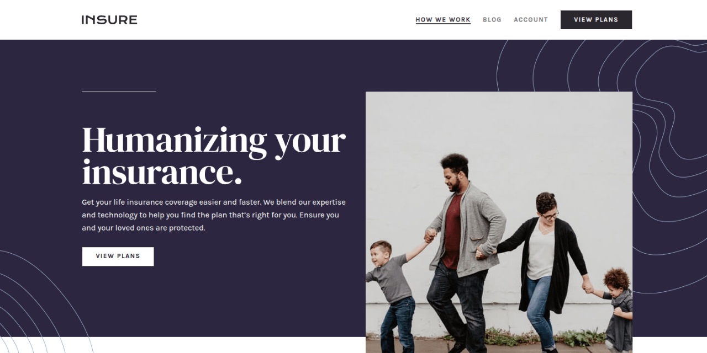
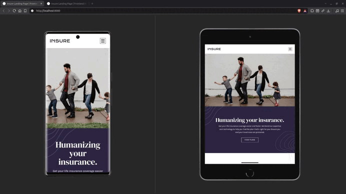

# Insure Landing Page

Responsive insurance landing page built with semantic HTML, modern CSS, and vanilla JavaScript. The project includes accessible mobile navigation, responsive layouts, and keyboard support.

---

## Links

- [**Live Preview**](https://vimpdev.github.io/fem-js-junior-04-insure-landing-page/)
- [**Frontend Mentor Solution**](https://www.frontendmentor.io/solutions/insure-landing-page-responsive-design-and-accessible-navigation-l6x7ewO2X5)

---

## Demo

---

## Screenshots

### Mobile

| Default | Default | Menu |
| --- | --- | --- |
|  |  |  |

### Tablet

| Default | Menu |
| --- | --- |
|  |  |

### Desktop

| Default | Hover | Focus |
| --- | --- | --- |
|  |  |  |

---

## Highlights

- **Responsive navigation**: Mobile and tablet use a collapsible navigation controlled by a button, while desktop exposes the navigation permanently.
- **Keyboard accessibility**: The mobile menu supports keyboard interaction, including `Escape` to close it, with clear `:focus-visible` states across the page.
- **Responsive image art direction**: `<picture>` is used to serve different hero images for mobile, tablet, and desktop.
- **CSS-driven UI states**: JavaScript manages application state while CSS handles the visual presentation of those states.
- **Responsive layout**: The page uses Flexbox, Grid, fluid sizing, logical properties, and breakpoint-specific layout changes.

---

## Technical Decisions

### Semantic HTML

The page uses semantic landmarks and native elements such as `header`, `nav`, `main`, `section`, `footer`, lists, headings, links, and buttons. Native HTML behavior is preferred over unnecessary ARIA.

### Mobile navigation state

The mobile navigation uses `isMenuOpen` as its internal state. This state is reflected through:

- `aria-expanded` on the toggle button.
- `.is-open` classes used by CSS.
- `inert` on the navigation and page content.
- The overlay state on `body`.

The resulting state model is:

| Context       | `isMenuOpen` | `aria-expanded` | `nav.inert` | `main.inert` | `footer.inert` |
| -------------- | -----------: | --------------- | ----------: | -----------: | -------------: |
| Mobile closed  |      `false` | `false`         |      `true` |      `false` |        `false` |
| Mobile open    |       `true` | `true`          |     `false` |       `true` |         `true` |
| Desktop        |      `false` | `false`         |     `false` |      `false` |        `false` |

### Responsive breakpoint detection

`window.matchMedia()` is used to detect the desktop breakpoint in JavaScript and keep the navigation state synchronized when the viewport crosses that breakpoint.

### CSS architecture

Cascade Layers separate reset, fonts, tokens, base styles, layout primitives, components, utilities, responsive rules, and interaction states.

### Image and decorative assets

Decorative artwork is implemented with pseudo-elements so it remains separate from the semantic content. The hero uses `<picture>` to switch between different image compositions based on viewport size.

---

## What I Learned

### `window.matchMedia()`

`window.matchMedia()` allows JavaScript to evaluate a media query and determine whether it currently matches the viewport. It is useful when JavaScript behavior needs to react to the same responsive conditions used by CSS.

### UI state synchronization

An interactive component can have several representations of the same state. In this project, `isMenuOpen` acts as the internal state, while `aria-expanded`, CSS classes, inert, and the overlay reflect that state in different parts of the interface.

#### `inert`

The `inert` attribute prevents a section of the document from receiving focus or user interaction. It is used to keep the closed navigation and the page content inaccessible while the mobile menu is open.

#### `:focus-visible`

`:focus-visible` provides focus styling when the browser determines that a visible focus indicator is appropriate. It improves keyboard navigation without forcing the same focus treatment for every pointer interaction.

### CSS Cascade Layers

`@layer` provides explicit control over the order in which groups of CSS rules participate in the cascade. I used layers to separate global styles, components, utilities, responsive rules, and interaction states.

### Native CSS Nesting

CSS nesting allows related selectors to be grouped inside their parent rule using native CSS, keeping component styles closer together.

### Logical Properties

Properties such as `inline-size`, `block-size`, `margin-inline`, and `inset-inline` describe layout in terms of writing direction instead of physical left, right, top, or bottom values.

### Responsive design

Responsive design is more than adding breakpoints. The layout changes according to the content and composition required at different viewport sizes, using Flexbox, Grid, fluid sizing, and media queries.

### Debugging responsive behavior

Testing on a real mobile device revealed horizontal overflow and responsive issues that were not obvious from the desktop reference. Isolating the affected element before changing global styles helped keep those fixes local to the component.

---

## Tech Stack

### HTML

- Semantic HTML
- Accessible landmarks
- Native interactive elements
- `<picture>` for responsive image art direction

### CSS

- Flexbox
- CSS Grid
- Cascade Layers
- Custom properties
- Native CSS Nesting
- Logical properties
- `min()`
- `text-wrap: balance`
- Responsive media queries
- `:focus-visible`
- `prefers-reduced-motion`

### JavaScript

- ES modules
- DOM API
- Event handling
- `window.matchMedia()`
- UI state management
- `inert`

### Tooling

- pnpm
- Servor
- Git
- GitHub Pages

---

## AI Collaboration

AI was used as a technical mentor and review partner during the project, mainly for architecture discussions, accessibility, responsive behavior, debugging, naming, and code review.

The implementation, testing, and final technical decisions were carried out during the development process.

---

## Author

- Frontend Mentor – [@vimpdev](https://www.frontendmentor.io/profile/vimpdev)

---

## Challenge Source

Built as a solution to the [Insure landing page challenge on Frontend Mentor](https://www.frontendmentor.io/challenges/insure-landing-page-uTU68JV8).